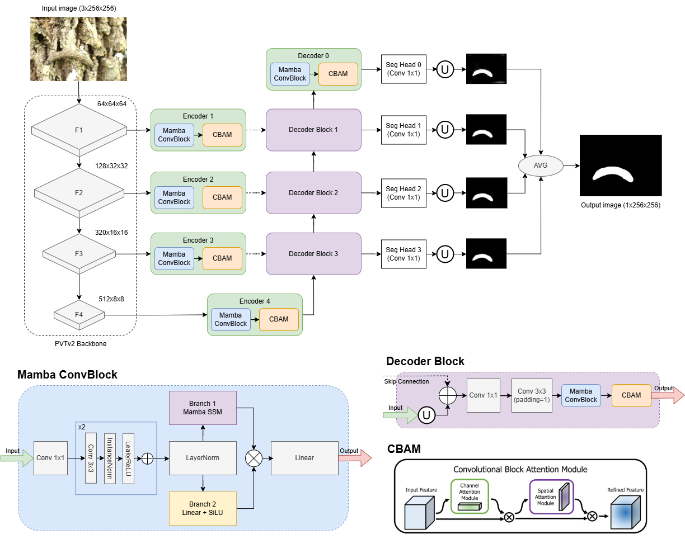
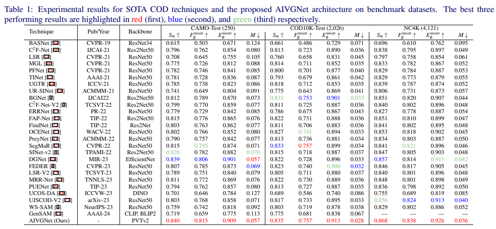

## [AINet]()

The overall architecture of the proposed AINet.
 
  

## Cotton Bollworm Dataset - Results

## Mango Dataset - Results

## Benchmark - Results
Experimental results for SOTA COD techniques and the proposed AINet architecture on benchmark datasets. The best three
performing results are highlighted in red (first), blue (second), and green (third) respectively.

  

 

The more qualitative mask results of AINet on three benchmarks (CAMO, NC4K, COD10K) and cotton bollworm datasets have already been stored in Kaggle.

The pretrained model is stored in Kaggle. After downloading, please put it in the pretrained_pvt fold.

Our well-trained models for benckmark and coton bollworm datasets are stored in Kaggle, which should be moved into the fold 'model_pth'. 
