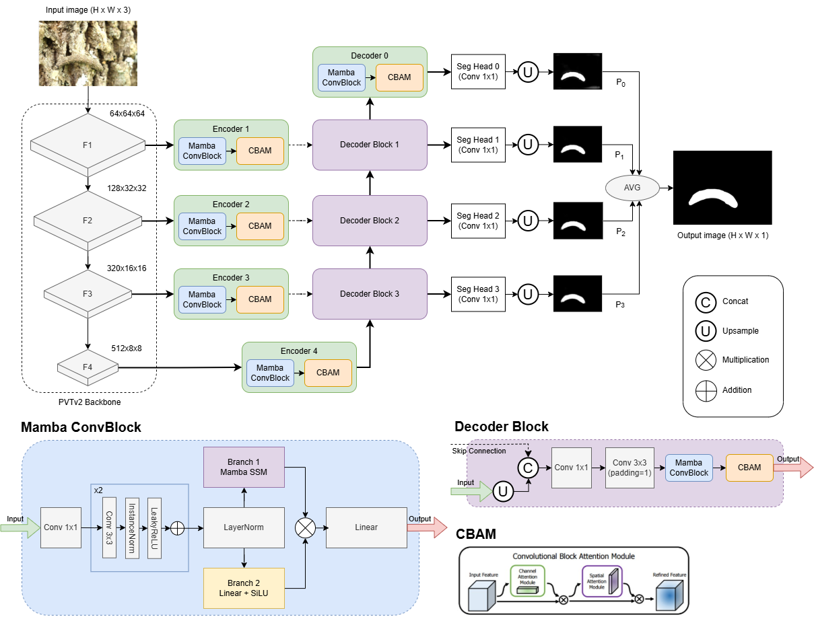
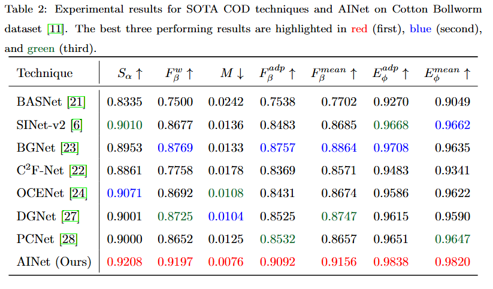
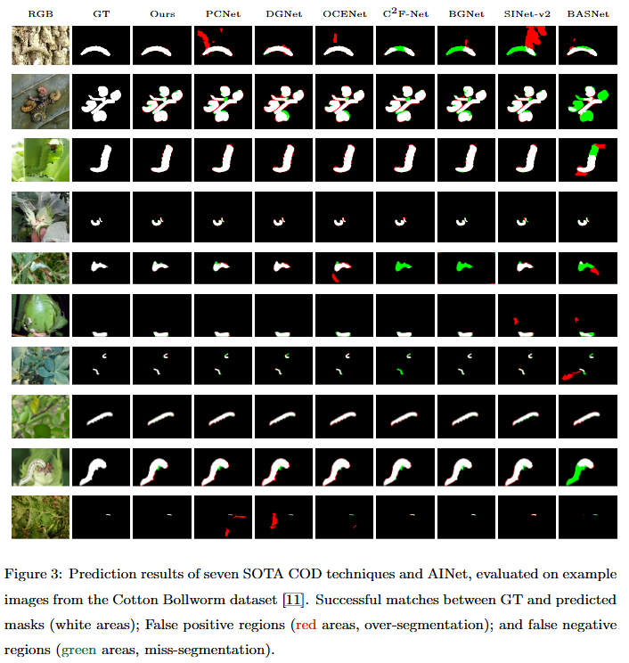
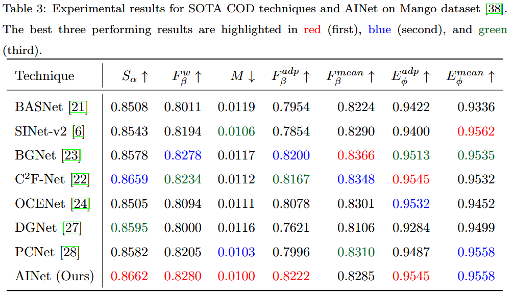
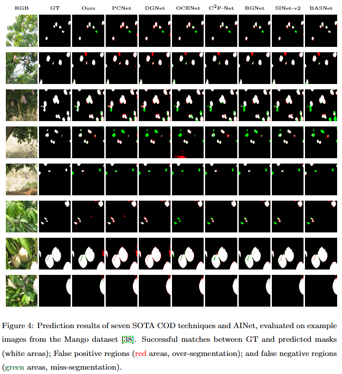
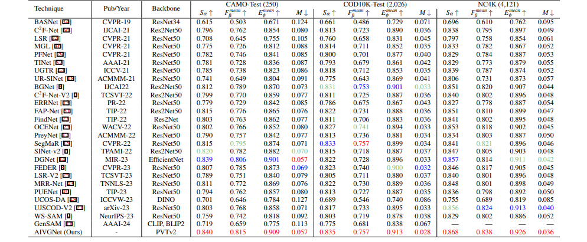

## [AINet]()

The overall architecture of the proposed AINet.
 
  

## Cotton Bollworm Dataset - Results

Table 2: Experimental results for SOTA COD techniques and AINet on Cotton Bollworm
dataset. The best three performing results are highlighted in red (first), blue (second),
and green (third).

 

Figure 3: Prediction results of seven SOTA COD techniques and AINet, evaluated on example
images from the Cotton Bollworm dataset. Successful matches between GT and predicted
masks (white areas); False positive regions (red areas, over-segmentation); and false negative
regions (green areas, miss-segmentation).

## Mango Dataset - Results

Table 3: Experimental results for SOTA COD techniques and AINet on Mango dataset.
The best three performing results are highlighted in red (first), blue (second), and green
(third).

 

Figure 4: Prediction results of seven SOTA COD techniques and AINet, evaluated on example
images from the Mango dataset. Successful matches between GT and predicted masks
(white areas); False positive regions (red areas, over-segmentation); and false negative regions
(green areas, miss-segmentation).

## Benchmark - Results
Table 4: Experimental results for SOTA COD techniques and the proposed AINet architecture on benchmark datasets. The best three performing
results are highlighted in red (first), blue (second), and green (third) respectively.
  

 

The more qualitative mask results of AINet on three benchmarks (CAMO, NC4K, COD10K) and cotton bollworm datasets have already been stored in Kaggle.

The pretrained model is stored in Kaggle. After downloading, please put it in the pretrained_pvt fold.

Our well-trained models for benckmark and coton bollworm datasets are stored in Kaggle, which should be moved into the fold 'model_pth'. 
