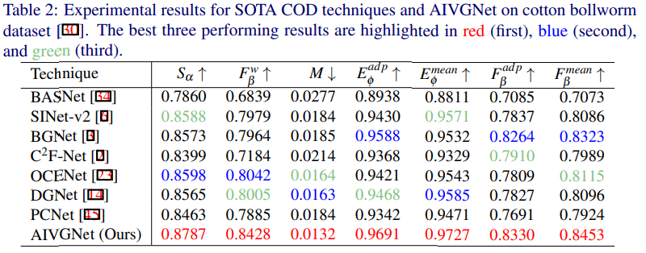

## [AIVGNet]()

The overall architecture of the proposed AIVGNet.
 
 <br>

Table 1: Experimental results for SOTA COD techniques and the proposed AIVGNet architecture on benchmark datasets. The best three
performing results are highlighted in red (first), blue (second), and green (third) respectively.

 <br>

Table 2: Experimental results for SOTA COD techniques and AIVGNet on cotton bollworm
dataset [1]. The best three performing results are highlighted in red (first), blue (second),
and green (third).

 <br>

<br>

```
@article{meng2024camouflaged,
  title={Camouflaged cotton bollworm instance segmentation based on PVT and Mask R-CNN},
  author={Meng, Kexin and Xu, Kexin and Cattani, Piercarlo and Mei, Shuli},
  journal={Computers and Electronics in Agriculture},
  volume={226},
  pages={109450},
  year={2024},
  publisher={Elsevier}
}

