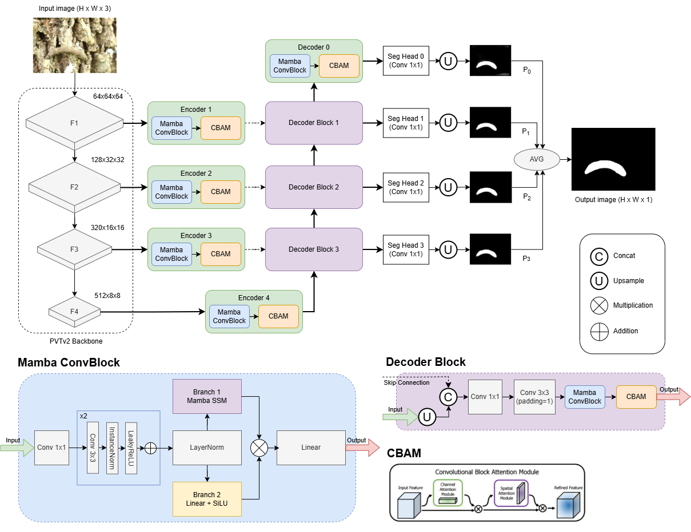
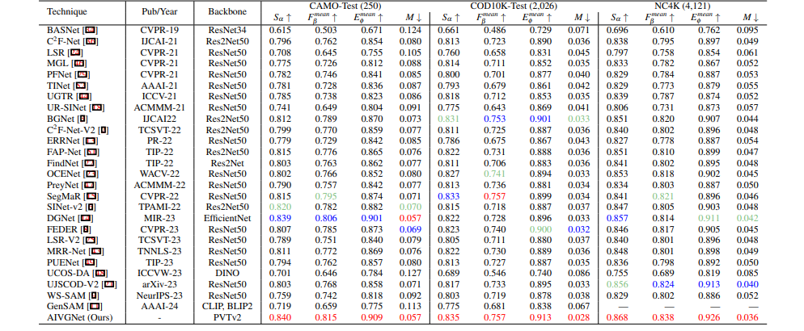
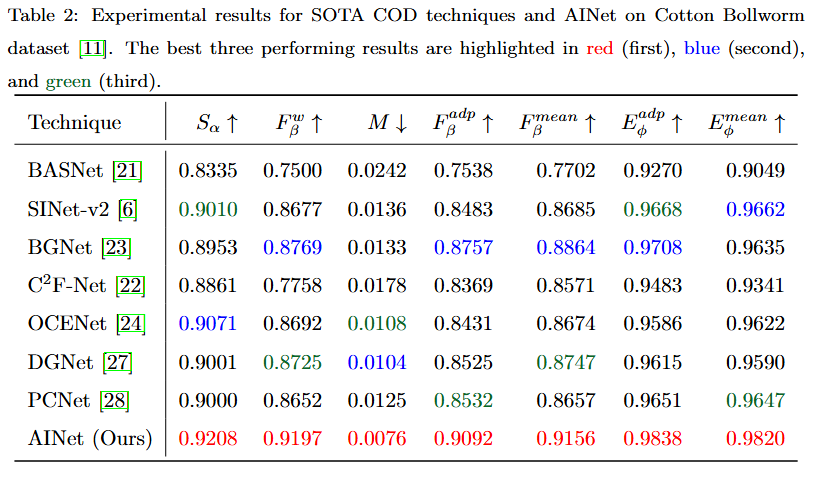
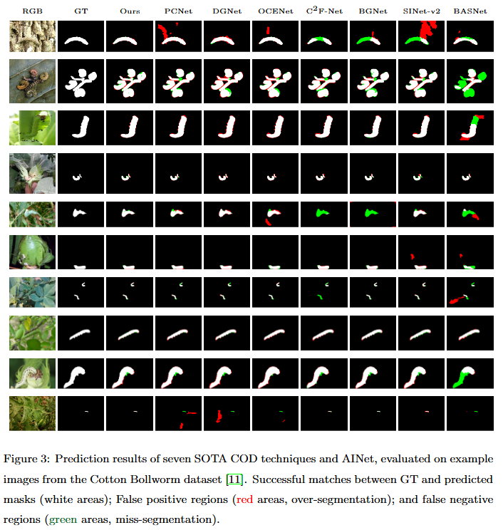
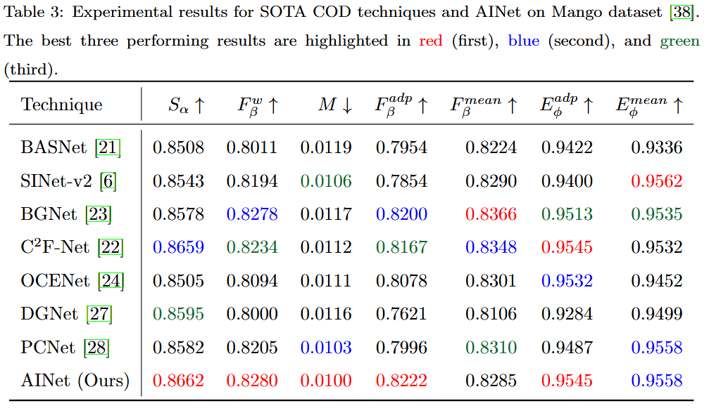
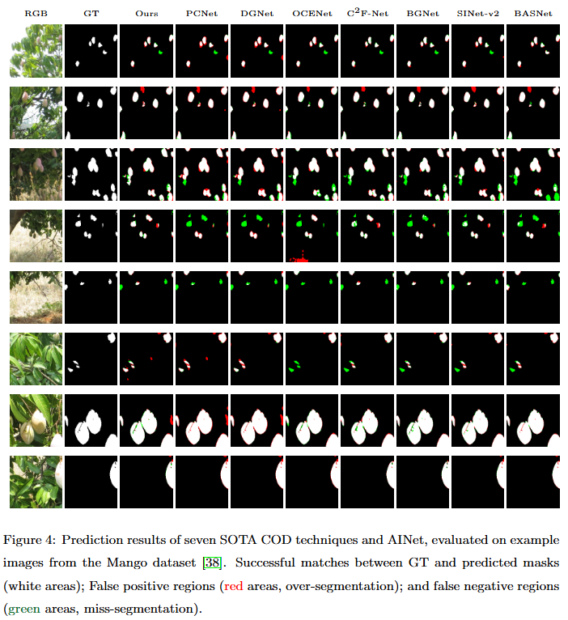

## [AINet: Integrating Mamba and CBAM for Enhanced Camouflage Object Detection]()
This paper introduces AINet, a novel deep learning architecture designed for detecting camouflaged objects in complex and diverse environments. The objective of this work is to design an end-to-end camouflaged object detection architecture that simultaneously captures long-range dependencies and refines subtle camouflage cues, improving segmentation accuracy and boundary delineation across both standard COD benchmarks and real-world agricultural scenarios. AINet leverages the strengths of Mamba, an efficient sequential state model for capturing long-range dependencies, and the Convolutional Block Attention Module (CBAM) for feature refinement through attention mechanisms. Detecting camouflaged objects is a significant challenge across a wide range of real-world applications, including surveillance, security, medical imaging, and autonomous systems, where objects of interest may blend into their backgrounds and evade conventional detection methods. To demonstrate its effectiveness, AINet is evaluated on multiple datasets, including standard camouflaged object detection benchmarks such as CAMO, COD10K, and NC4K, as well as domain-specific datasets (such as pest and fruit detection). Experimental results show that AINet outperforms existing state-of-the-art models. The implementation is publicly available on GitHub for reproducibility: https://cod-espol.github.io/AINet/

IEEE Access paper: https://doi.org/10.1109/ACCESS.2026.3668115

The overall architecture of the proposed AINet.
 <br>


## Benchmark - Results
Experimental results for SOTA COD techniques and the proposed AINet architecture on benchmark datasets. The best three performing results are highlighted in red (first), blue (second), and green (third), respectively.
 <br>

<br>

## Cotton Bollworm Dataset - Results

Experimental results for SOTA COD techniques and AINet on the Cotton Bollworm dataset. The best three performing results are highlighted in red (first), blue (second), and green (third).



<br>

Prediction results of seven SOTA COD techniques and AINet, evaluated on example images from the Cotton Bollworm dataset. Successful matches between GT and predicted masks (white areas); False positive regions (red areas, over-segmentation); and false negative regions (green areas, miss-segmentation).



## Mango Dataset - Results

Experimental results for SOTA COD techniques and AINet on the Mango dataset. The best three performing results are highlighted in red (first), blue (second), and green (third).



<br>

Prediction results of seven SOTA COD techniques and AINet, evaluated on example images from the Mango dataset. Successful matches between GT and predicted masks (white areas); False positive regions (red areas, over-segmentation); and false negative regions (green areas, miss-segmentation).



<br>

## CODE
Code for training and testing available at Kaggle: https://www.kaggle.com/code/hvelesaca/ainet 

The more qualitative mask results of AINet on Cotton Bollworm, Mango, and three benchmarks (CAMO, NC4K, COD10K) datasets are available in the folder [results](results).

The pretrained model is stored in Kaggle. After downloading, please put it in the pretrained_pvt folder.

Our well-trained models for Coton Bollworm, Mango, and Benchmark datasets are stored in Kaggle, which should be moved into the 'model_pth'. 


## Citation
If you use AINet, please cite the following paper.
```
@article{velesaca2026ainet,
  title={AINet: Integrating Mamba and CBAM for Enhanced Camouflage Object Detection},
  author={Velesaca, Henry O and Mero, P Andrea and Reyes-Angulo, Abel and Sappa, Angel D},
  journal={IEEE Access},
  year={2026},
  publisher={IEEE}
}
```


