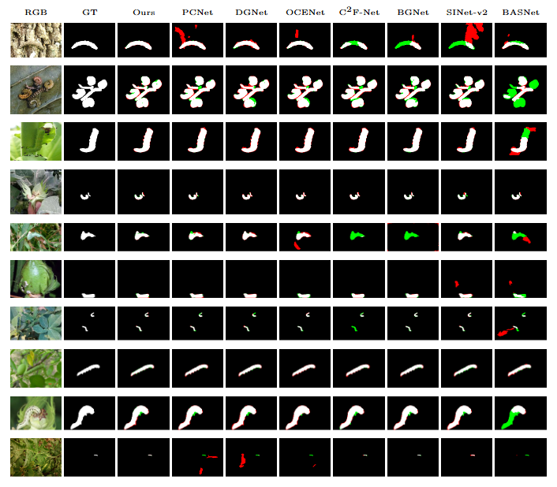

## [AINet]()

The overall architecture of the proposed AINet.
 
  

## Benchmark - Results
Experimental results for SOTA COD techniques and the proposed AINet architecture on benchmark datasets. The best three performing results are highlighted in red (first), blue (second), and green (third), respectively.
  

 

## Cotton Bollworm Dataset - Results

Experimental results for SOTA COD techniques and AINet on Cotton Bollworm dataset. The best three performing results are highlighted in red (first), blue (second), and green (third).

 

Prediction results of seven SOTA COD techniques and AINet, evaluated on example images from the Cotton Bollworm dataset. Successful matches between GT and predicted masks (white areas); False positive regions (red areas, over-segmentation); and false negative regions (green areas, miss-segmentation).

## Mango Dataset - Results

Experimental results for SOTA COD techniques and AINet on the Mango dataset. The best three performing results are highlighted in red (first), blue (second), and green (third).

 

Prediction results of seven SOTA COD techniques and AINet, evaluated on example images from the Mango dataset. Successful matches between GT and predicted masks (white areas); False positive regions (red areas, over-segmentation); and false negative regions (green areas, miss-segmentation).

 

## CODE
Code for training and testing available at Kaggle: https://www.kaggle.com/code/hvelesaca/ainet 

The more qualitative mask results of AINet on Cotton Bollworm, Mango, and three benchmarks (CAMO, NC4K, COD10K) datasets have already been stored in Kaggle.  

The pretrained model is stored in Kaggle. After downloading, please put it in the pretrained_pvt folder.

Our well-trained models for Coton Bollworm, Mango, and Benchmark datasets are stored in Kaggle, which should be moved into the 'model_pth'. 

